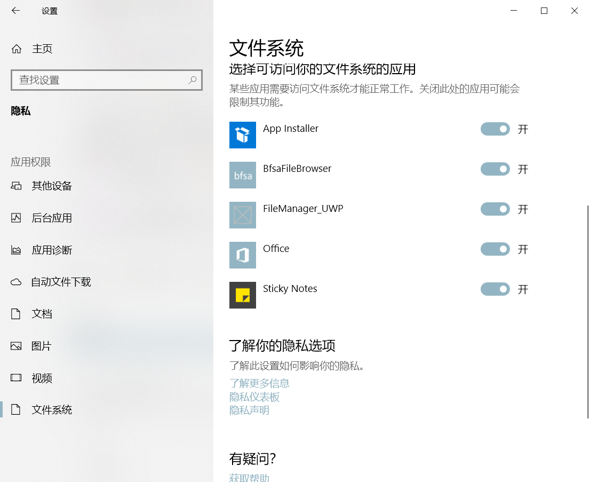
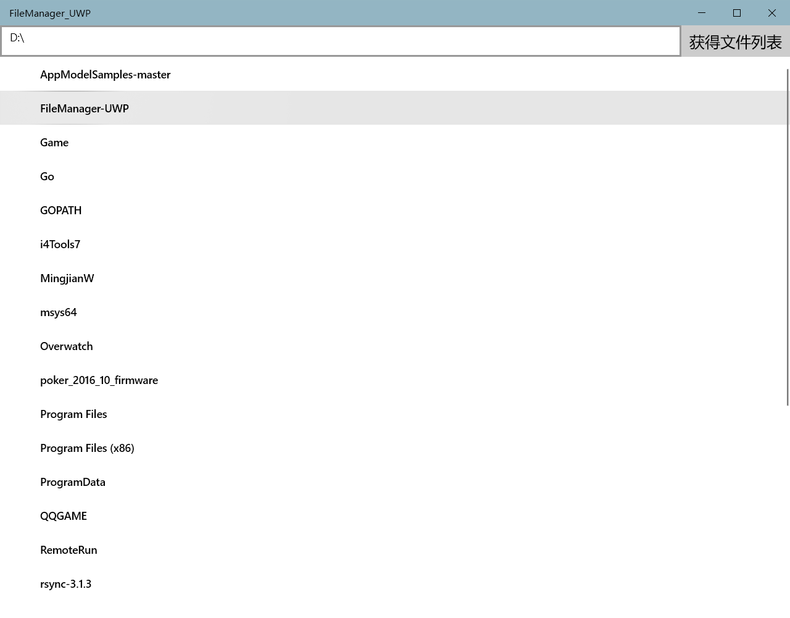
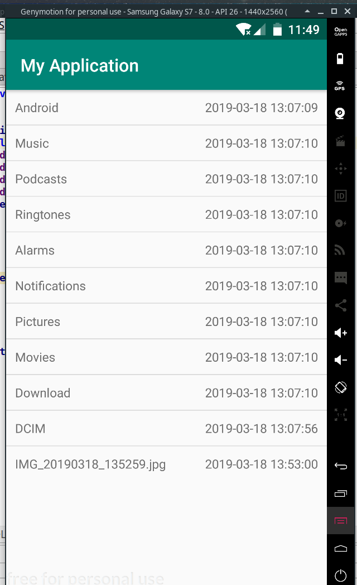

# UVP Homework 20190323

## 王明键

1. Please choose a technique that can contribute to your app from https://docs.microsoft.com/en-us/windows/uwp/develop/

   访问文件系统功能。

2. Explain why it would contribute to your app.

   作为一个文件管理器，需要访问文件系统的功能。

   为了减少UWP应用和Win32应用之间的差异，微软在1809版本为UWP加入了访问文件系统的功能，在此之前UWP应用只能自由读写少数几个目录。

   使用方法：

   1. 在```Package.appxmanifest```文件中声明```broadFileSystemAccess```权限。

      ```xml
      <Package
        ...
        xmlns:rescap="http://schemas.microsoft.com/appx/manifest/foundation/windows10/restrictedcapabilities"
        IgnorableNamespaces="uap mp uap5 rescap">
      ...
      <Capabilities>
          <rescap:Capability Name="broadFileSystemAccess" />
      </Capabilities>
      ```

   2. 使用```IAsyncOperation<StorageFolder> GetFolderFromPathAsync(string path)```函数获得指定位置的文件列表，再对文件列表进行遍历，显示在屏幕上。

      ```C#
      StorageFolder folder = null;
      try {
          folder = await StorageFolder.GetFolderFromPathAsync(path);
      } catch (Exception ex) {
          DebugPanel.Text = ex.Message;
      }
      if (null != folder) {
      TreeViewNode rootNode = new TreeViewNode() { Content = folder.Name };
      IReadOnlyList<StorageFolder> folders = await folder.GetFoldersAsync();
      IReadOnlyList<StorageFile> files = await folder.GetFilesAsync();
      Files.Clear();  // Files是绑定在List View上的ObservableCollection
      foreach(StorageFolder f in folders) {
          Files.Add(new DisplayFileFolderItem { Name = f.Name });
      }
      foreach (StorageFile f in files) {
          Files.Add(new DisplayFileFolderItem { Name = f.Name });
      }
      ```

   3. 在设置中为本应用授予文件系统权限。

      

   4. 效果截图
   
      

3. In the client dev platform for the last assignment, figure out if your chosen platform supports that technique. If so, demonstrate how to use it.

   Android访问文件系统使用的是Java原生API。无论是设计思路还是使用方式上与UWP无太大不同，但是Android可以使用```verifyStoragePermissions```函数弹出对话框向用户申请权限，而UWP必须由用户在设置中手动打开权限。可见Android还是比UWP要成熟一些。

   1. 在```AndroidManifest.xml```中声明存储权限。

      ```xml
      <uses-permission android:name="android.permission.WRITE_EXTERNAL_STORAGE" />
      <uses-permission android:name="android.permission.READ_EXTERNAL_STORAGE" />
      ```

   2. 获得文件列表

      ```java
      verifyStoragePermissions(this);  // 验证是否获得权限
      File path = getExternalStorageDirectory();
      Log.i("external storage", path.getAbsolutePath());
      File[] sub_files = path.listFiles();
      for (File s: sub_files) {
          HashMap<String, String> t = new HashMap<>();
          t.put("name", s.getName());
          SimpleDateFormat df = new SimpleDateFormat("yyyy-MM-dd HH:mm:ss", Locale.CHINA);
          String date = df.format(new Date(s.lastModified()));
          t.put("date", "" + date);
          file_items.add(t);  // file_item为绑定的列表
      }
      ```

   3. 截图
   
      
      

## 才明洋

1. Please choose a technique that can contribute to your app from https://docs.microsoft.com/en-us/windows/uwp/develop/

   data binding

2. Explain why it would contribute to your app.

   文件管理器中最重要的功能是显示文件列表，这需要显示文件，根据文件的变化更改显示，甚至通过`view`更改数据。这可以采用数据绑定的方式，将文件的数据结构绑定到`view`中。

3. In the client dev platform for the last assignment, figure out if your chosen platform supports that technique. If so, demonstrate how to use it.

   `html`无法直接实现数据绑定，但可以使用一些前端框架来实现绑定功能，例如`vue.js`

   实现方法：

   * 插入内容

     ~~~html
     <div id="app">
         {{name}}	// 插值
     </div>
     <script>
     new Vue({
       el:"#app",
       data:{
         name:"real name",
       }
     })
     </script>
     ~~~

     

     将需要绑定的变量用双大括号括起来，这样在最终渲染的时候就可以将其替换成变量的值。在绑定时要注明属性名。

   * 绑定`html`内容

   ~~~html
   <div id="app">
   	<span v-html="rawHtml"></span>
   </div>
   <script>
   	  el:"#app",
     data:{
       rawHtml:"<h1>Header</h1>",
     }
   });
   </script>
   ~~~

## 张晨
1. Please choose a technique that can contribute to your app from https://docs.microsoft.com/en-us/windows/uwp/develop/
      	 日期选择功能
   ​    	 实现方式

      ```xml
   <CalendarDatePicker PlaceholderText="Pick a date" Header="Calendar" />
      ```

2. Explain why it would contribute to your app.
   ​     在我们的文件管理器中，我们打算做一个虚拟目录的功能。
   ​    用户可以在不同的时间添加不同的工程和文件目录。
   ​    日期选择器可以让用户查找到具体某天的工程情况

3. In the client dev platform for the last assignment, figure out if your chosen platform supports that technique. If so, demonstrate how to use it.

   ​    在微信小程序中：
   ​    picker组件可以完成这个功能
   ​    首先看一下picker的官方文档：
   ​    picker
   ​    从底部弹起的滚动选择器，现支持五种选择器，通过mode来区分，分别是普通选择器，多列选择器，时间选择器，日期选择器，省市区选择器，默认是普通选择器。
   ​	坑1：不能改样式！
   ​	坑2：picker组件在ios和android上的展示效果不同
   ​	所以如果想自定义的话请用picker-view:
   ​	picker-view
   ​	嵌入页面的滚动选择器

   | 属性名          | 类型        | 说明                                                         |
   | --------------- | ----------- | :----------------------------------------------------------- |
   | value           | NumberArray | 数组中的数字依次表示 picker-view 内的 picker-view-column 选择的第几项（下标从 0 开始），数字大于 picker-view-column 可选项长度时，选择最后一项。 |
   | indicator-style | String      | 设置选择器中间选中框的样式                                   |
   | indicator-class | String      | 设置选择器中间选中框的类名                                   |
   | mask-style      | String      | 设置蒙层的样式                                               |
   | mask-class      | String      | 设置蒙层的类名                                               |
   | bindchange      | EventHandle | 当滚动选择，value 改变时触发 change 事件，event.detail = {value: value}；value为数组，表示 picker-view 内的 picker-view-column 当前选择的是第几项（下标从 0 开始） |
   | bindpickend     | EventHandle | 当滚动选择结束时候触发事件                                   |
   | aria-label      | String      | 无障碍访问，（属性）元素的额外描述                           |

   Picker:
   ~~~html
   <view class="section">
   <view class="section__title">日期选择器</view>
   <picker mode="date" value="{{date}}" start="2015-09-01" end="2017-09-01" bindchange="bindDateChange">
   	<view class="picker">
   		当前选择: {{date}}
   	</view>
   </picker>
   </view>
   ~~~


